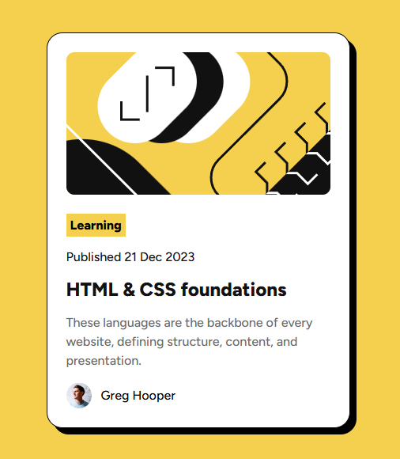

# Frontend Mentor - Blog Preview Card

A blog preview card built with HTML and CSS as part of a Frontend Mentor challenge.

This project recreates the provided Frontend Mentor Blog Preview Card design using semantic HTML and custom CSS.

## Screenshot

## Built with

- HTML5
- CSS3
- Flexbox
- Custom fonts with `@font-face`
- Git & GitHub
@font-face

## What I learned

While building this project, I practiced:

- Structuring a page with semantic HTML
- Working with the CSS box model
- Using padding, margins, borders, and shadows
- Using Flexbox to align elements
- Working with custom fonts using `@font-face`
- Controlling typography with `font-size`, `font-weight`, and `line-height`
- Sizing and positioning images
- Using `object-fit` to control how images fit their containers
- Comparing my implementation against a reference design
- Using Git commits and GitHub throughout the development process

## AI Assistance

I used ChatGPT as a learning and development assistant throughout this project. It helped me understand HTML and CSS concepts, troubleshoot issues, compare my implementation with the reference design, and work through the project step-by-step.

I wrote, tested, and committed the project code myself.

## Author

Quentin Cyrus